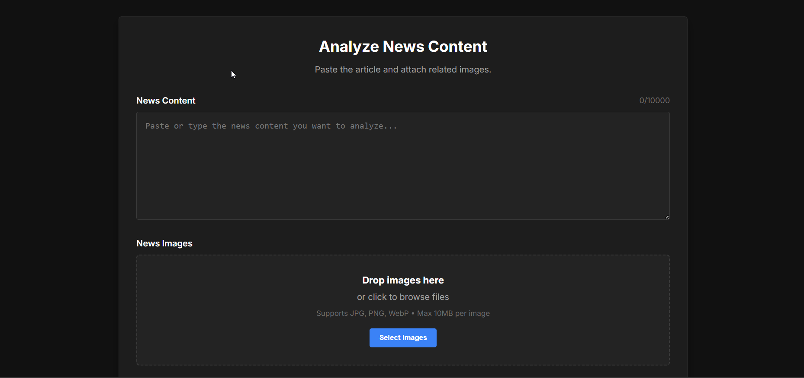
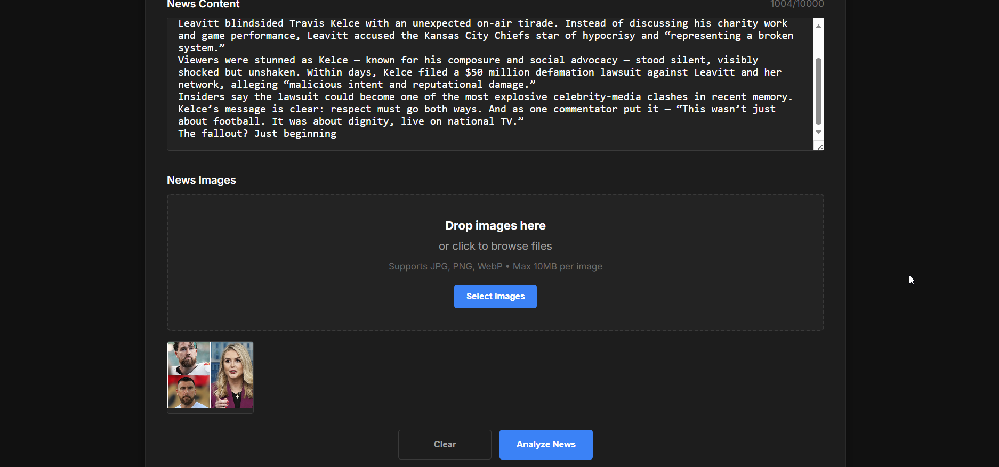
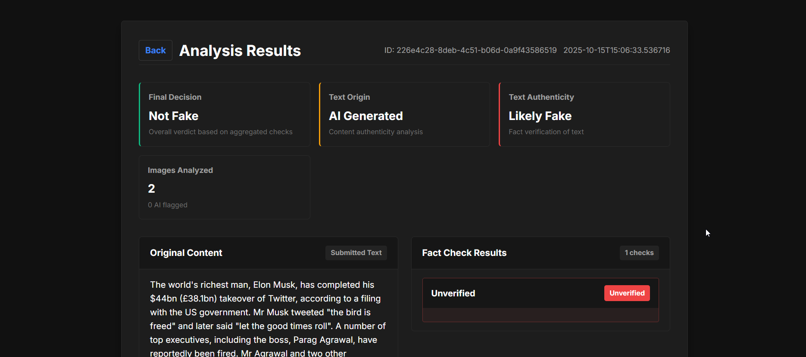
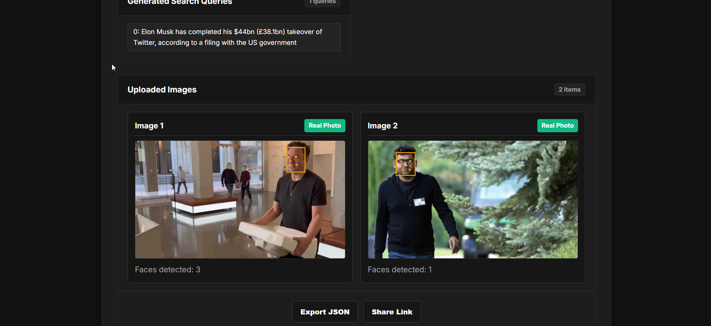
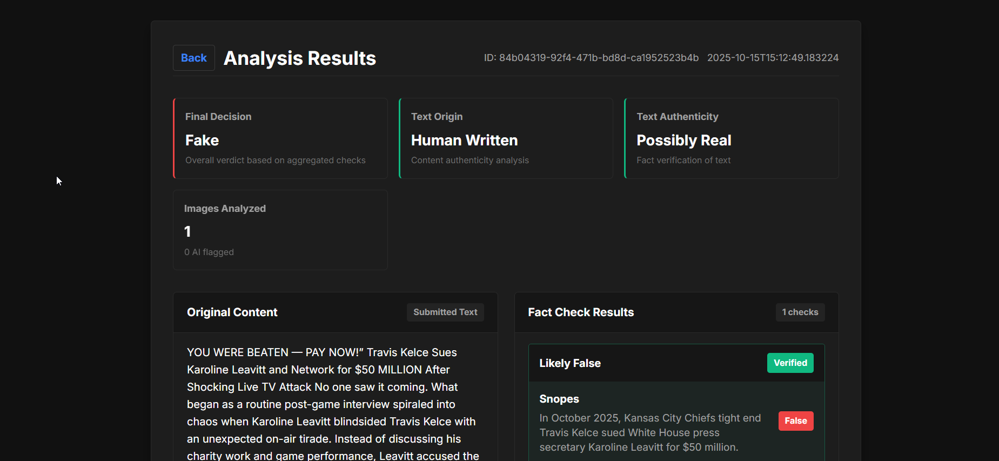
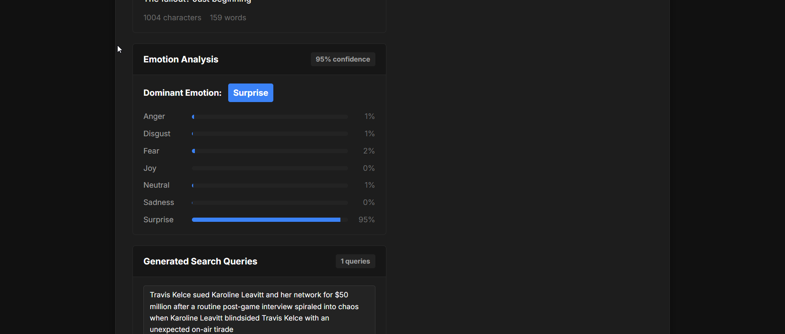
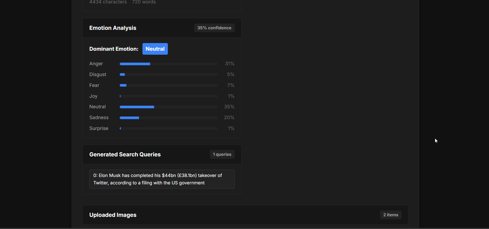

# FactSight: Advanced Fake News Detection System

[](https://www.python.org/downloads/)
[](https://flask.palletsprojects.com/)
[](https://pytorch.org/)
[](https://opensource.org/licenses/MIT)

## 📋 Table of Contents

- [Overview](#overview)
- [Architecture](#architecture)
- [Installation](#installation)
- [Usage](#usage)
- [Services & Models Deep Dive](#services--models-deep-dive)
  - [Text Analysis Services](#text-analysis-services)
  - [Image Analysis Services](#image-analysis-services)
  - [Fact-Checking Integration](#fact-checking-integration)
- [Model Performance](#model-performance)
- [Demo Media Files](#demo-media-files)
- [Configuration](#configuration)
- [API Endpoints](#api-endpoints)
- [Contributing](#contributing)
- [License](#license)

## 🎯 Overview

**FactSight** is a comprehensive fake news detection system that combines multiple AI/ML technologies to analyze news content for authenticity. The system performs multi-modal analysis using both **text** and **image** content to determine if news articles are genuine or fabricated.

### Key Features

- **🔍 Multi-Modal Analysis**: Combines text and image analysis for comprehensive fact-checking
- **🤖 AI Content Detection**: Identifies AI-generated text and images
- **🧠 Deep Learning Models**: Uses state-of-the-art neural networks for classification
- **🔗 External Fact-Checking**: Integrates with Google Fact Check Tools API
- **📊 Emotion Analysis**: Detects sensationalism in news content
- **👤 Face Analysis**: Analyzes faces in images for deepfake detection
- **🌐 Web Interface**: User-friendly web application for easy analysis

## 🏗️ Architecture

```
┌─────────────────────────────────────────────────────────────────┐
│                        FactSight System                         │
├─────────────────────────────────────────────────────────────────┤
│  ┌─────────────┐  ┌─────────────┐  ┌─────────────┐              │
│  │   Flask     │  │   Core      │  │  Services   │              │
│  │   Web App   │  │  Manager    │  │ & Models    │              │
│  └─────────────┘  └─────────────┘  └─────────────┘              │
├─────────────────────────────────────────────────────────────────┤
│  ┌─────────────┐  ┌─────────────┐  ┌─────────────┐              │
│  │   Text      │  │   Image     │  │   Fact      │              │
│  │  Analysis   │  │  Analysis   │  │  Checking   │              │
│  └─────────────┘  └─────────────┘  └─────────────┘              │
├─────────────────────────────────────────────────────────────────┤
│  ┌─────────────┐  ┌─────────────┐  ┌─────────────┐              │
│  │   LSTM      │  │ EfficientNet│  │   Google    │              │
│  │ Classifier  │  │    B3       │  │ Fact Check  │              │
│  └─────────────┘  └─────────────┘  └─────────────┘              │
└─────────────────────────────────────────────────────────────────┘
```

## 🚀 Installation

### Prerequisites

- Python 3.11+
- CUDA-compatible GPU (recommended for faster inference)
- 8GB+ RAM
- 4GB+ free disk space

### Setup Instructions

1. **Clone the repository**
   ```bash
   git clone <https://github.com/DeepActionPotential/FactSight>
   cd FactSight
   ```

2. **Install dependencies**
   ```bash
   pip install -r requirements.txt
   ```

3. **Download required models from [HUGGINGFACE](<https://huggingface.co/spaces/DeepActionPotential/FactSight/tree/main/models>)** (if not included)
   ```bash
   # Models will be automatically downloaded on first run
   # or placed in the models/ directory
   ```

4. **Configure environment**
   ```bash
   # Set your Google Fact Check API key in config.py
   FACT_API_KEY = "your-api-key-here"
   ```

5. **Run the application**
   ```bash
   python app.py
   ```

6. **Access the web interface**
   ```
   Open http://localhost:5000 in your browser
   ```

## 📖 Usage

### Web Interface

1. **Navigate to the homepage** (`/`)
2. **Paste news text** in the text area (max 10,000 characters)
3. **Upload images** related to the news (drag & drop or browse)
4. **Click "Analyze"** to start the fact-checking process
5. **View detailed results** including:
   - Overall authenticity score
   - Text analysis breakdown
   - Image analysis results
   - Fact-checking verification
   - Emotion analysis

### API Usage

```python
import requests

# Submit for analysis
response = requests.post('http://localhost:5000/analyze', json={
    'text': 'Your news article text here...',
    'images': [
        {'data': 'base64-encoded-image-data'}
    ]
})

analysis_id = response.json()['analysis_id']

# Get results
results = requests.get(f'http://localhost:5000/analysis/{analysis_id}')
```

## 🔬 Services & Models Deep Dive

### Text Analysis Services

#### 1. **AI Text Detection** (`ai_text_service.py`)
- **Model**: Custom-trained classifier [placeholder for url]
- **Architecture**: Joblib-based scikit-learn model
- **Performance**: **99% F1-Score**
- **Purpose**: Distinguishes between AI-generated and human-written text
- **Features**: Text preprocessing, feature extraction, binary classification

#### 2. **Fake News Classification** (`fake_text_news_service.py`)
- **Model**: Custom LSTM Neural Network [placeholder for url]
- **Architecture**:
  - Embedding layer (100 dimensions)
  - Bidirectional LSTM (128 hidden units)
  - Dropout regularization (0.5)
  - Sigmoid output layer
- **Performance**: **99% F1-Score**
- **Purpose**: Classifies news as fake or real
- **Features**:
  - Text cleaning and preprocessing
  - Contraction expansion
  - Stopword removal
  - Sequence padding/truncation (300 tokens)

#### 3. **Emotion Analysis** (`text_emotion_service.py`)
- **Model**: `j-hartmann/emotion-english-distilroberta-base`
- **Architecture**: DistilRoBERTa transformer model
- **Purpose**: Detects emotional tone (anger, fear, joy, etc.)
- **Features**:
  - Chunked processing for long texts
  - Confidence-weighted aggregation
  - Sensationalism detection

#### 4. **Search Query Extraction** (`search_queries_service.py`)
- **Model**: `transformers` pipeline for question generation
- **Purpose**: Extracts key claims from text for fact-checking
- **Features**: NLP-based query generation

### Image Analysis Services

#### 1. **AI Image Detection** (`ai_image_service.py`)
- **Model**: Custom EfficientNet-B3 [placeholder for url]
- **Architecture**:
  - EfficientNet-B3 backbone
  - Custom classification head
  - Binary classification (AI vs Real)
- **Performance**: **99% F1-Score**
- **Purpose**: Identifies AI-generated vs real images
- **Features**:
  - 300x300 input resolution
  - Batch normalization
  - GPU acceleration

#### 2. **Face Detection** (`face_detection_service.py`)
- **Model**: `scrfd` (pre-trained ONNX model)
- **Purpose**: Detects and locates faces in images
- **Features**:
  - Multi-scale face detection
  - Landmark extraction (eyes, nose, mouth)
  - Confidence scoring
  - NMS (Non-Maximum Suppression)

#### 3. **Deepfake Detection** (`deepfake_service.py`)
- **Model**: Meso4 architecture (two variants)
  - `Meso4_DF.h5`: Trained on DeepFake dataset
  - `Meso4_F2F.h5`: Trained on Face2Face dataset
- **Architecture**:
  - 4 convolutional layers
  - Batch normalization
  - Max pooling
  - Dropout (0.5)
  - Sigmoid classification
- **Purpose**: Detects manipulated faces in images
- **Features**:
  - Dual-model ensemble
  - Face cropping integration
  - Confidence threshold adjustment

### Fact-Checking Integration

#### **Fact Check Service** (`fact_search_service.py`)
- **API**: Google Fact Check Tools API v1alpha1
- **Purpose**: External verification of claims
- **Features**:
  - Multi-source fact-checking
  - Verdict aggregation
  - Confidence scoring
  - Source credibility assessment

## 📊 Model Performance

| Model | Type | F1-Score | Dataset | Purpose |
|-------|------|----------|---------|---------|
| **AI Text Detector** | Custom Classifier | **99%** | Custom | AI vs Human Text |
| **Fake News LSTM** | LSTM Neural Network | **99%** | Custom | Fake vs Real News |
| **AI Image Detector** | EfficientNet-B3 | **99%** | Custom | AI vs Real Images |
| **Emotion Detector** | DistilRoBERTa | N/A | Pre-trained | Emotion Analysis |
| **Face Detector** | SCRFD | N/A | Pre-trained | Face Detection |
| **Deepfake Detector** | Meso4 | N/A | Custom | Deepfake Detection |

## 🎬 Demo Media Files

The `demo/` folder contains sample media:


### Videos
- <video src="./demo/demo.mp4" controls width="720"></video>


### Images
- `demo1.png` - 
- `demo2.png` - 
- `demo3.png` - 
- `demo4.png` - 
- `demo5.png` - 
- `demo6.png` - 
- `demo7.png` - 

## ⚙️ Configuration

### Environment Variables

```python
# config.py
class Config:
    flask: FlaskConfig = FlaskConfig(
        SECRET_KEY = os.environ.get('SECRET_KEY', 'dev-secret-key'),
        UPLOAD_FOLDER = 'static/uploads',
        MAX_CONTENT_LENGTH = 50 * 1024 * 1024  # 50MB
    )

    service: ServiceConfig = ServiceConfig(
        FACT_API_KEY = "your-google-fact-check-api-key",
        FAKENESS_SCORE_THRESHOLD = 0.6,
        FACE_DETECTION_THRESHOLD = 0.5
    )
```

### Model Paths

```python
# Model file locations
AI_TEXT_DETECTOR = "./models/ai_text_detector.joblib"
FAKE_NEWS_DETECTOR = "models/fake_news_detector.pt"
EFFICIENTNET_AI_IMAGE = "./models/efficientnet_b3_full_ai_image_classifier.pt"
FACE_DETECTION = "models/face_det_10g.onnx"
MESO4_DF = "models/Meso4_DF.h5"
MESO4_F2F = "models/Meso4_F2F.h5"
```

## 🔗 API Endpoints

| Method | Endpoint | Description |
|--------|----------|-------------|
| GET | `/` | Main analysis interface |
| POST | `/analyze` | Submit content for analysis |
| GET | `/analysis/<id>` | View analysis results |
| GET | `/health` | System health check |

## 🤝 Contributing

1. Fork the repository
2. Create a feature branch (`git checkout -b feature/amazing-feature`)
3. Commit your changes (`git commit -m 'Add amazing feature'`)
4. Push to the branch (`git push origin feature/amazing-feature`)
5. Open a Pull Request

### Development Guidelines

- Follow PEP 8 style guidelines
- Add tests for new features
- Update documentation
- Ensure model compatibility

## 📝 License

This project is licensed under the MIT License - see the [LICENSE](LICENSE) file for details.

##  Acknowledgments

- **Hugging Face** for transformer models and pipelines
- **Google** for Fact Check Tools API
- **PyTorch Team** for deep learning framework
- **OpenCV** for computer vision utilities
- **SCRFD** for face detection models

##  Support

For support and questions:
- Create an issue in the repository
- Contact: [your-email@example.com]

##  Version History

### v1.0.0
- Initial release with full multi-modal fake news detection
- 99% F1-scores on custom trained models
- Comprehensive web interface
- Integration with external fact-checking services

---

**FactSight** - Bringing truth to the digital age through advanced AI-powered analysis. 🛡️
